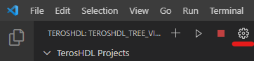

.. _general:

General settings
================

TerosHDL settings are separated in two separate places :
 - The extension settings, availables in Visual Studio settings (``File > Preferences > Settings``)
 - The project settings, available in the TerosHDL.

The extension settings will handle everything related to HDL edition such as linting or formatting 
while the project settings are used to setup the test suite (VUnit).

Python3 path
------------

Python3 is automatically usable by TerosHDL if it's in your system path.
But a custom path can be configures if it's not the case in

``Teroshdl › Global: Python3-path``

.. image:: images/python3_path.png 
           :alt: Python path field in Visual Code settings
           

Documenter
----------

:doc:`Documenter settings <documenter>`  

Formatter
---------

VHDL
~~~~

For VHDL configurations go to ``Teroshdl › Formatter › VHDL › Type > Standalone`` in the extension settings.

Configurations available:

-  **Align-comments**:
    Select to align comments.
-  **Align-function**:
    Align signs in function.
-  **Align-generic**
    Align signs in generic.
-  **Align-port**
    Align signs in port.
-  **Align-procedure**
    Align signs in procedure.
-  **Indentation**
    Add spaces for indentation.
-  **Keyword-case**
    Lowercase/Uppercase
-  **Type-name-case**
    Lowercase/Uppercase

Verilog
~~~~~~~

For Verilog the configurations available are the following:

-  **Spaces**:
    Space per indent.
-  **Style**:
    Different styling options.

    .. image:: images/formatter_verilog_istyle.png
               :alt: Available styles dropdown for iStyle

Linter
------

:doc:`Linter settings <linters>`  